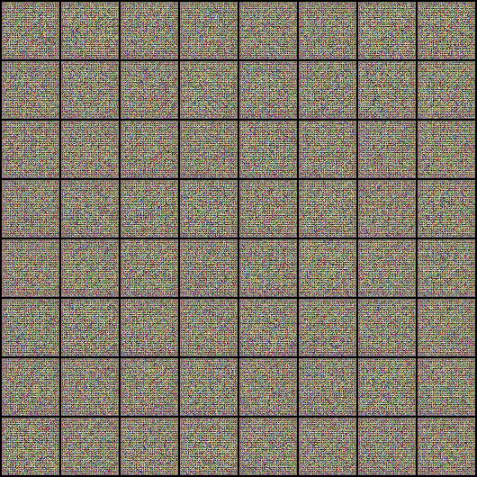

# Anime-GAN 
Anime Gen generates a fake anime face using a GAN which learned from a dataset of 1k anime face drawings. You can also control the output by changing the values of top 3 features learned by the Neural Network

